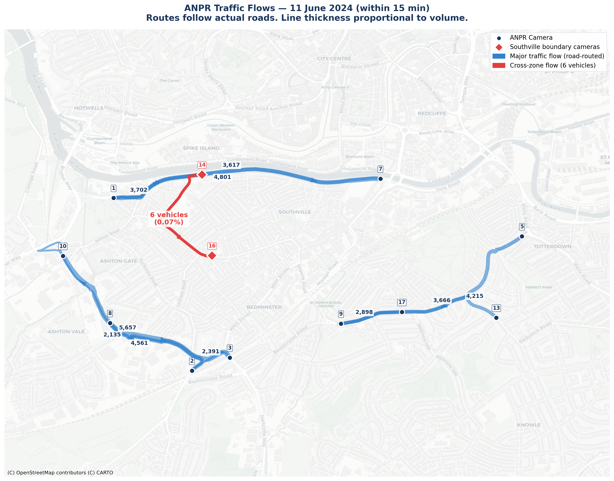

# Independent Analysis of the SBLN 2024 Traffic Survey Data

**Author:** Ali Bin Shahid, Volunteer Data Analyst & Systems Engineer



## Overview

This repository contains the code and analysis for an independent review of Bristol City Council's South Bristol Liveable Neighbourhoods (SBLN) 2024 Traffic Survey data.

Bristol City Council claims:

> *"Traffic data show that high numbers of vehicles from outside the area use residential streets in Southville as a cut-through to other destinations."*

This analysis examines whether the publicly available survey data supports that claim.

## Key Finding

The ANPR (Automatic Number Plate Recognition) camera network — the only survey type capable of tracking vehicle routes — had **no cameras placed within the Southville Zone**. The two nearest cameras (Camera 14 on Coronation Road and Camera 16 on North Street) recorded only **10-11 vehicles per day** appearing at both locations, representing **0.07-0.14%** of traffic at those cameras. Even these vehicles cannot be confirmed as having driven through the residential area.

## Data Source

- **Dataset:** SBLN 2024 Traffic Survey Results (94 spreadsheets)
- **Survey Period:** June 2024
- **Contractor:** Intelligent Data Collection Ltd (Project ID-0524-0183)
- **Commissioned by:** Bristol City Council

The raw data is publicly available from Bristol City Council and is not included in this repository. Download it here:

**[SBLN Traffic Survey Results 2024 (zip, 126.71 MB)](https://www.bristol.gov.uk/residents/streets-travel/south-bristol-liveable-neighbourhoods)** — look for "SBLN Traffic survey results 2024" on the page.

## Repository Structure

```
├── generate_all_charts.py      # Master chart generation (21 charts)
├── generate_all_maps.py        # Sensor location maps (5 maps)
├── generate_flow_map_routed.py # OSRM road-routed ANPR flow map
├── generate_analysis_map.py    # Comprehensive analysis map (all layers)
├── generate_pdf.py             # Full analysis report (PDF)
├── generate_executive_pdf.py   # Executive summary report (PDF)
├── generate_docx.py            # Internal working document (DOCX)
├── generate_additional_charts.py # Bus/cyclist charts (supplementary)
├── charts/                     # Generated chart images
└── data/                       # Source data (not included, see below)
```

### Superseded Scripts (kept for reference)
```
├── generate_map.py             # Original sensor map (replaced by generate_all_maps.py)
├── generate_charts.py          # Original 6 charts (replaced by generate_all_charts.py)
├── generate_new_charts.py      # Charts 10-13 (merged into generate_all_charts.py)
├── fix_all.py                  # One-off fixes (no longer needed)
├── fix_charts.py               # One-off fixes (no longer needed)
```

## How to Reproduce

### Prerequisites

```bash
pip install matplotlib numpy contextily requests reportlab openpyxl python-docx
```

### Generate All Charts

```bash
python generate_all_charts.py
```

Generates 13 charts in `charts/` from the survey data, including:
- ANPR cross-zone context (pie charts)
- Camera 14 and 16 destination breakdowns
- Dominant ANPR traffic flows with road names
- ATC daily volumes, hourly profiles, speed distributions
- Weekday vs weekend patterns
- Junction turning counts
- Trip generation model and waterfall breakdown

### Generate Maps

```bash
python generate_all_maps.py         # 5 sensor location maps
python generate_flow_map_routed.py  # OSRM road-routed flow map
python generate_analysis_map.py     # Comprehensive analysis map
```

Note: The flow map and analysis map require internet access (OSRM routing API and CartoDB map tiles).

### Generate Reports

```bash
python generate_pdf.py              # Full analysis report
python generate_pdf.py --headline   # Headline version (no trip generation)
python generate_executive_pdf.py    # Executive summary (10 pages)
python generate_docx.py             # Internal working document
```

## Data Files Required

Place the survey data in `data/SBLN 2024 Traffic Survey Results/` with this structure:

```
data/SBLN 2024 Traffic Survey Results/
├── ANPR surveys/           # 6 files (OD matrices, sample rates, trip chains)
├── ATC surveys/            # 22 files (Sites 1-22, volume + speed)
├── JTC surveys/            # 22 files (11 sites x 2 days)
├── Bus Stop counts/        # 19 files (boarding/alighting)
├── JTC Queue length surveys/ # 22 files
└── MCC surveys/            # 4 files (vehicle classification + cycles)
```

## Camera Coordinates

ANPR camera positions are from the official KML file (Project ID-0524-0183). ATC site coordinates are extracted from cell A8 of the "Site Details" sheet in each ATC spreadsheet. JTC coordinates are from the queue length survey spreadsheets.

## Methodology

1. **ANPR Analysis:** Cross-tabulation of the Origin-Destination matrices for cameras bordering the Southville Zone (Cameras 14 and 16), destination analysis, trip chain review
2. **ATC Analysis:** Tuesday-Thursday averages for daily volumes, hourly profile comparison, weekday vs weekend patterns, speed distribution analysis
3. **JTC Analysis:** Turning movement analysis at the two junctions on the Southville Zone perimeter
4. **Trip Generation:** Census 2021 ward-level data (Southville + Bedminster wards) combined with TRICS residential trip generation rates

## Tools

Analysis code was developed with assistance from [Claude Code](https://claude.ai/claude-code) (Anthropic).

## License

This analysis is provided for public interest purposes. The underlying data is publicly available from Bristol City Council.
